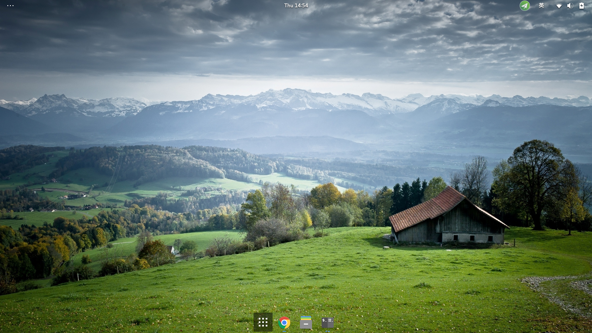
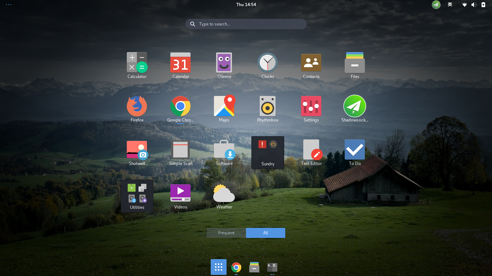

# awesome-fedora-hacking
Hacking your Fedora system, make it awesome! :-D

In order to make the code works, confirm you have installed gnome-tweak-tool. If not, run the following command to install

	sudo dnf install gnome-tweak-tool -y

## hack-gnome-shell.sh
`hack-gnome-shell.sh` will hack your gnome shell, adding some extensions and themes to make it more convenient and elegant. You will have an awesome shell in the end. 

### Installation
You can directly run the script by

	curl -sLf https://raw.githubusercontent.com/gaunthan/awesome-fedora-hacking/master/hack-gnome-shell.sh | bash

### Installed packages
#### Extensions
- gnome-shell-extension-user-theme
- gnome-shell-extension-dash-to-dock
- gnome-shell-extension-topicons-plus
 
#### Themes
- arc-theme
- pop-icon-theme
- breeze-cursor-theme

### Removed packages

- gnome-shell-extension-apps-menu
- gnome-shell-extension-dash-window-list
- gnome-shell-extension-launch-new-instance
- gnome-shell-extension-background-logo
- gnome-shell-extension-alternative-tab

Above packages see very little use, so I decide to remove them. Comment corresponding lines to avoid removement.

### Configurations
This script will configure your gnome shell's appearance as shown

which will enabling the following extensions

### Screenshots
#### Desktop

#### Preview

## dynamic-panel-transparency.sh
Thanks to rockon999 for sharing such awesome extension [rockon999/dynamic-panel-transparency](https://github.com/rockon999/dynamic-panel-transparency).

### Installation
Run the follwing command to install it :

	curl -sLf https://raw.githubusercontent.com/gaunthan/awesome-fedora-hacking/master/dynamic-panel-transparency.sh | bash

### Screenshots
Pay attention to the top bar, you will see the changes.

#### Desktop

#### Preview

## coding-is-life.sh
Install essential and generic developemt tools and softwares, building an out-of-the-box environment for programmer.

### Installation
Run the follwing command to install:

	curl -sLf https://raw.githubusercontent.com/gaunthan/awesome-fedora-hacking/master/coding-is-life.sh | bash

## prompt-soul.sh
A Powerline like prompt for Bash:

Run the follwing command to install:

	curl -sLf https://raw.githubusercontent.com/gaunthan/awesome-fedora-hacking/master/prompt-soul.sh | bash

## fcitx-rime-installer.sh
A installer script for installing fcitx and fcitx-rime! 

Just run the following command and then reboot your system, you will have fcitx be all set

	curl -sLf https://raw.githubusercontent.com/gaunthan/awesome-fedora-hacking/master/fcitx-rime-installer.sh | bash
	
