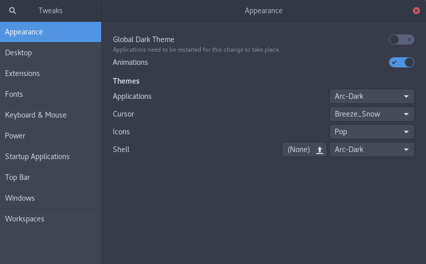
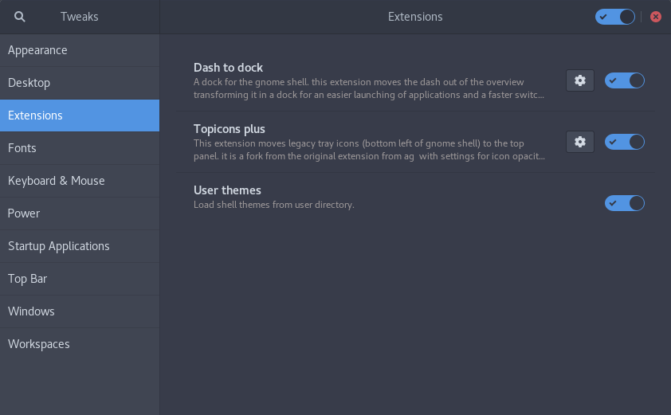
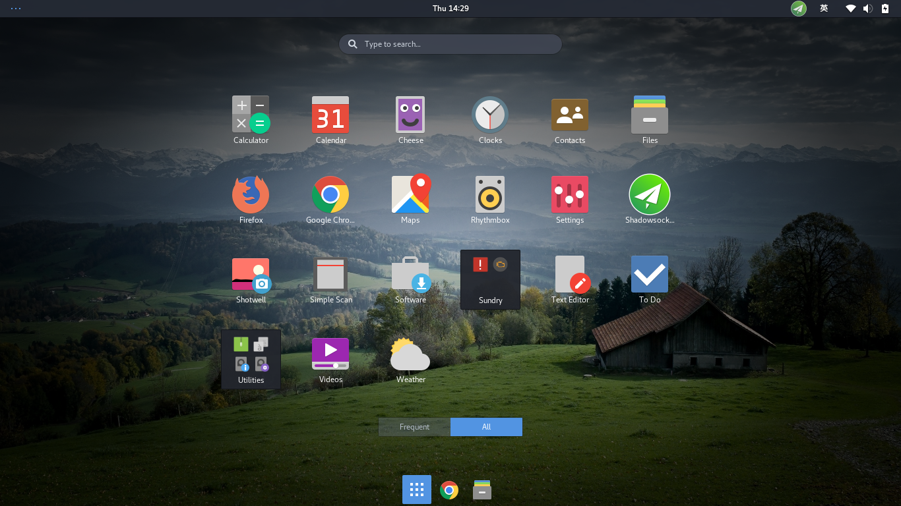
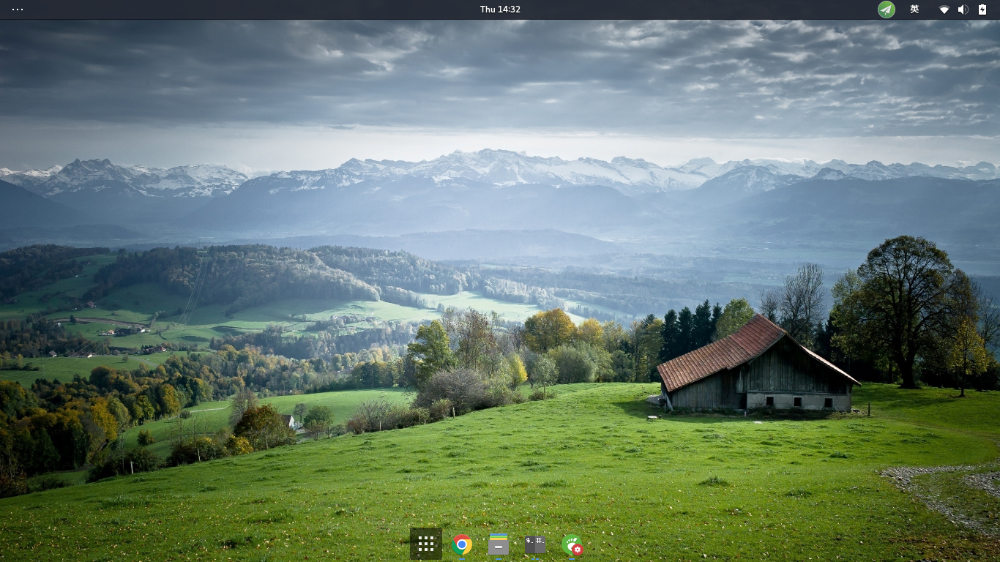

# awesome-fedora-hacking
Hacking your Fedora system, make it awesome! :-D

## hack-gnome-shell.sh
This script will hach your gnome shell, adding extensions and themes to make it more convenient and elegant. You will get an awesome shell in the end. 
### Installed packages
#### Extensions

- gnome-shell-extension-user-theme
- gnome-shell-extension-dash-to-dock
- gnome-shell-extension-topicons-plus

#### Themes

- arc-theme
- pop-icon-theme
- breeze-cursor-theme

### Removed packages

- gnome-shell-extension-apps-menu
- gnome-shell-extension-dash-window-list
- gnome-shell-extension-launch-new-instance
- gnome-shell-extension-background-logo
- gnome-shell-extension-alternative-tab

Above packages see very little use, so I decide to remove them. Comment corresponding lines to avoid removement.

### Configurations
This script will configure your gnome shell's appearance as shown

with enabled extensions

### Screenshots
#### Preview

#### Desktop

